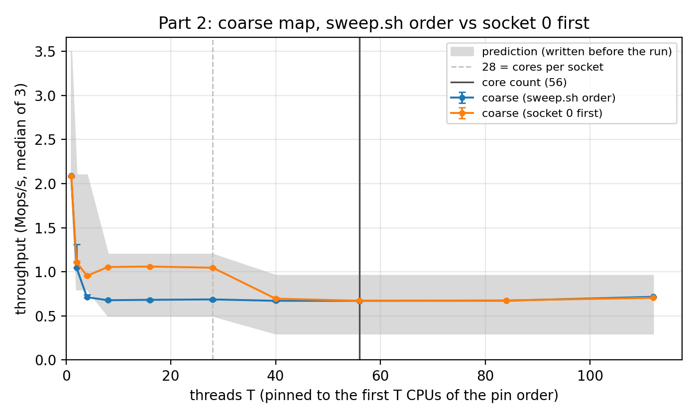
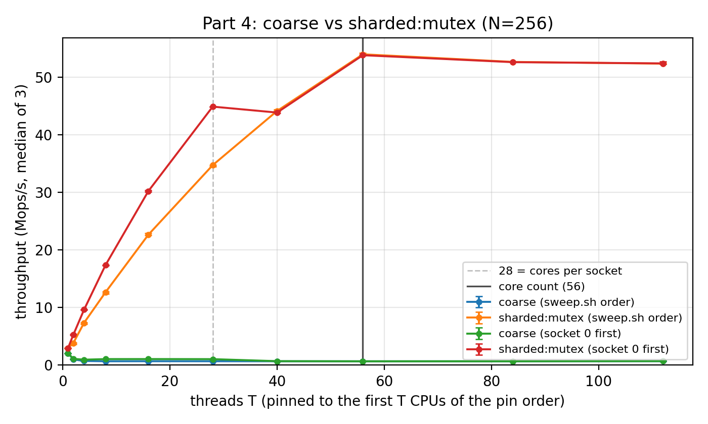
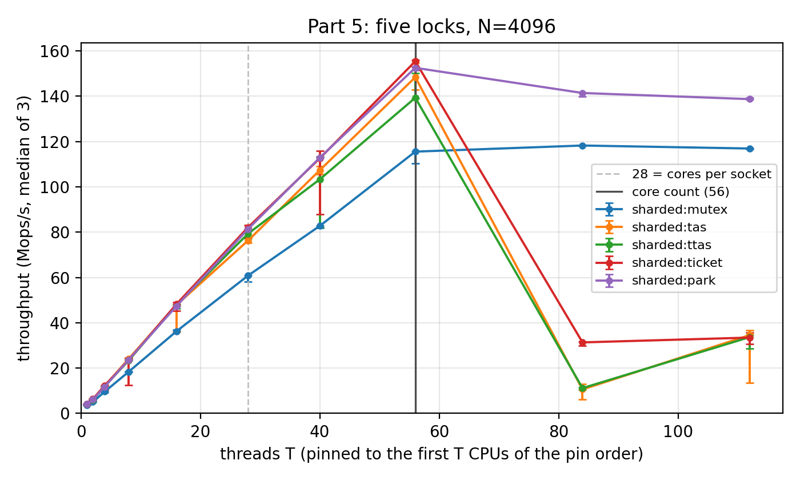
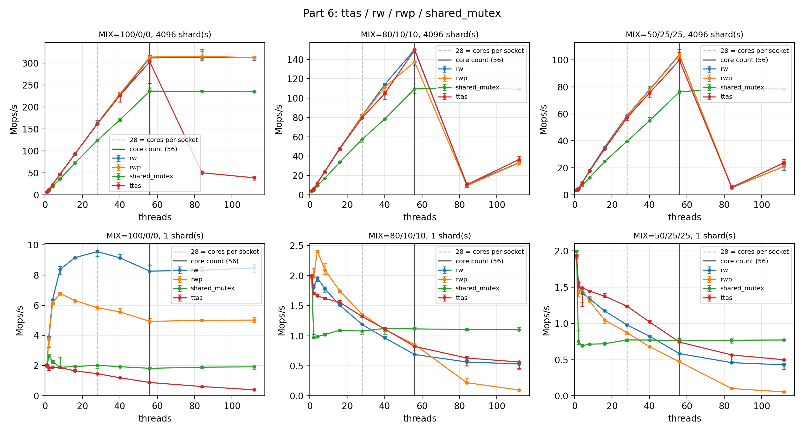

**Part 1**

*Code.* `CoarseMap` is one `std::map` and one `std::mutex`, with a `lock_guard` in every method. `insert` uses `insert_or_assign`, because the tests require an existing key's value to be overwritten. `make test` and `make tsan` pass (TSan lines in the appendix).

*Why `size()` needs the lock.* `std::map::size()` reads the tree's element count (`_M_node_count`). Every insert of a new key increments it, and every successful erase decrements it. Reading it while another thread writes it is a data race, which is undefined behaviour in C++. There is no happens-before edge between the write and the read, so the compiler may keep a stale value, and TSan reports the race. With the lock, the previous holder's unlock (a release) happens-before our lock (an acquire). `size()` therefore returns the exact count at one instant between operations.

*Why the interface returns copies.* A reference or iterator into the map would outlive the `lock_guard` that made reading it safe. As soon as `find` returns, another thread could:

- erase that key and free the node, leaving a dangling reference (the freed chunk can be reused at once by the next insert, so the caller would read some other key's value);
- overwrite the value with `insert`, a race that tears a non-trivial `V`;
- rebalance the tree, so an iterator's `++` follows pointers that are being rewritten.

Copying `out = it->second` while the lock is held gives the caller a private value.

**Part 2**

*Prediction*:

- the peak is at T = 1, at 2–3.5 Mops/s;
- at T = 2–4, throughput falls to 40–60 % of T = 1;
- a plateau of 0.5–1.2 Mops/s holds through T = 28;
- once threads reach the second socket, there is a further 20–40 % step down;
- the curve is flat past 56, because std::mutex waiters sleep instead of spinning.

*Protocol.* One Frontera compute node: c207-021, job 7972219, 2 × Xeon Platinum 8280, 28 cores per socket, SMT off (`lscpu` is in the appendix). The run used `sweep.sh`: taskset-pinned, median of three 2-s runs. It printed:
`# cores=56 hwthreads=56 sockets=2 cores/socket=28 pin order: 0 1 2 3 … 55`, with `<- first socket full` at T = 28 and `<- every core busy` at T = 56.

*Topology caveat.* `lscpu` shows `NUMA node0 CPU(s): 0,2,4,…,54` and `node1: 1,3,…,55`; Frontera numbers its CPUs alternately by socket. sweep.sh pins in CPU-number order, so **from T = 2 its threads already span both sockets**, and the "first socket full" tag at T = 28 is wrong: at T = 28 the threads are split 14 + 14. We also ran a copy of sweep.sh with only the pin order changed to socket 0 first (0, 2, …, 54, then 1, 3, …), on node c208-017. It shows where the real socket boundary is. The two curves agree to within 0.6 % wherever they use the same CPU set (T = 1, 56, 84).

| T | 1 | 2 | 4 | 8 | 16 | 28 | 40 | 56 | 84 | 112 |
|---|---|---|---|---|---|---|---|---|---|---|
| sweep.sh order | 2.088 | 1.048 | 0.712 | 0.678 | 0.682 | 0.687 | 0.671 | 0.671 | 0.672 | 0.716 |
| socket 0 first | 2.084 | 1.108 | 0.954 | 1.054 | 1.060 | 1.046 | 0.695 | 0.672 | 0.676 | 0.705 |

Values are Mops/s, median of three. Every three-run spread is within ±2 %, except sweep.sh T = 2 (1.045–1.313) and T = 4 (0.710–0.744).

{: style="width:56%"}

*Prediction vs measurement.*

- **Peak:** at T = 1 (2.09 Mops/s), as predicted, at the low end of the range.
- **T = 2–4:** 53 % and 46 % of T = 1 on one socket (predicted 40–60 %).
- **Plateau:** flat at 1.05 Mops/s on one socket (T = 8–28), inside the predicted 0.5–1.2.
- **Socket boundary:** in the socket-first curve, throughput **drops 34 % from T = 28 to 40** (1.046 → 0.695), as predicted. In sweep.sh order, the same cross-socket penalty already appears at T = 4 (0.712 vs 0.954), so that curve shows nothing at 28.
- **Past 56:** flat (0.67–0.72), as predicted. T = 112 is 5–7 % higher on both nodes, which we cannot explain.

**Part 3**

*The contended line.* `CoarseMap`'s mutex is `alignas(64)`, so its cache line is the same in every run.

- **Line 0** holds the pthread mutex word (bytes 0–39) and the map's root pointer (byte 56). Every operation reads and writes it: the lock CAS, the root read, and the unlock.
- **Line 1** holds leftmost, rightmost and the element count. It is written by the ≈10–15 % of operations that change the size.
- The tree's upper levels are read-mostly. They sit in S in every core's cache and cause no traffic.

*MESI states between handoffs.*

- On the holder's core, line 0 is **Modified**: its CAS wrote it, and its unlock writes it again.
- On every other core it is **Invalid**, because the holder's read-for-ownership invalidated their copies. Sleeping waiters hold nothing.
- A handoff goes like this. The next acquirer's load misses. The snoop finds the line Modified in the previous holder's cache (a HITM) and forwards the 64-B line. The acquirer's CAS then upgrades its copy to M, and the old copy becomes I.
- What moves is one line: the lock word plus the root pointer, and line 1 on size-changing operations.

*Cost of one handoff.* The coherence session measured 40 ns core-to-core on one socket, 100 ns across sockets: ≈130 and ≈330 cycles at the measured 3.3 GHz. Our counters agree in order of magnitude. From T = 1 to T = 8, user cycles per op rise by ≈1000 while user L1 misses rise by 9.6, about one of which is a HITM. Charging the other misses as L3 hits leaves ≈400–570 cycles (≈130–190 ns) per handoff. This is an estimate and an upper bound, since misses can overlap.

*Counters.* All runs are on one socket (CPUs 0; 0,2,…,14; 0,2,…,54) with 5-s runs, and every value is per operation.

- "all" counts user and kernel events (Frontera has `perf_event_paranoid=0`); ":u" repeats the run with user-mode hardware counters only.
- Values are perfstat's printed per-op numbers. Counting starts just after the warm-up, so the counters cover 94.8 % of the timed run, and true per-op values are ≈5.5 % higher.

| | T=1 all | T=1 :u | T=8 all | T=8 :u | T=28 all | T=28 :u |
|---|---|---|---|---|---|---|
| operations | 10,908,672 | 10,643,456 | 5,204,992 | 5,092,352 | 5,087,232 | 5,074,944 |
| Mops/s | 2.182 | 2.129 | 1.040 | 1.018 | 1.014 | 1.012 |
| cycles/op | 1,445 | 1,465 | 11,110 | 2,469 | 65,810 | 2,889 |
| instructions/op | 330.5 | 323.6 | 4,907 | 353.5 | 11,060 | 361.4 |
| IPC | 0.229 | 0.221 | 0.442 | 0.143 | 0.168 | 0.125 |
| L1 misses/op | 25.29 | 24.26 | 143.7 | 33.84 | 225.4 | 38.18 |
| LLC misses/op | 0.489 | 0.508 | 0.975 | 0.911 | 0.829 | 0.843 |
| HITM/op | 0.0003 | 0.0000 | 17.74 | 0.93 (0.93–1.32) | 37.39 | 1.55 (1.18–1.55) |
| context switches/op | 0.0000003 | 0.0000008 | 0.528 | 0.544 | 0.759 | 0.766 |

*L1 misses per operation at T = 1.*

- **Estimate from the tree:** the tree holds 2¹⁹ ≈ 512K nodes, so a lookup walks ≈19–20 levels. The 32 KB L1 holds about the top 8 levels, and the 1 MB L2 about the top 13–14. That leaves ≈11–12 levels missing L1: ≈5–6 of them hit L2 and the rest come from L3.
- **What we measured:** 24–25 L1 misses per op, about twice that estimate. LLC misses are only 0.5 per op, because the ≈32 MB tree fits in the 38.5 MB L3.
- **Likely reason for the factor of two:** each missing level costs two line fills. The counter also counts lines brought in by prefetch, and a node's child pointers and key can sit on different lines. This is untested.

*Cycles vs L1-miss growth from T = 1 to T = 8.*

- In user mode, cycles per op grow ×1.69 while L1 misses grow only ×1.39. In all mode the factors are ×7.7 and ×5.7, and at T = 28 they are ×45.5 and ×8.9.
- The extra misses are expensive ones. Each costs ≈105 cycles (1004 extra cycles / 9.6 extra misses), against ≈14 for an L2 hit, because they are coherence misses that find the line Modified in another core, plus L3 refills.
- In all mode, the kernel's futex and scheduler work adds ≈8,600 cycles per op at T = 8 (78 % of all cycles) and ≈63,000 at T = 28 (96 %).

*HITM vs handoffs.* We expect up to one counted handoff per acquisition that comes from another core (≤ 7/8 at T = 8). Add one for each arriving thread that fails and goes to sleep (≈0.53 per op), plus line 1 (≈0.1). That gives ≈0.9–1.7 per op. The user-mode HITM of 0.93–1.32 (T = 8) and 1.18–1.55 (T = 28) falls inside that range. The all-mode HITM (17.7 and 37.4) is mostly kernel lines: ≈32–47 per context switch.

*Context switches, and why throughput gets worse instead of flat.*

- **Where the time goes:** at T = 8, about every second operation puts a thread to sleep in the futex (0.53 per op); at T = 28 it is three in four (0.76). Threads are on-CPU only 55 % and 80 % of the time, and the map work adds up to about one core's worth; the rest is kernel time.
- **Why it gets worse:**
  - Pure serialization would hold the T = 1 rate. Instead, every critical section now starts with a coherence miss and an ownership upgrade.
  - Every unlock with a sleeper makes a `futex_wake` system call that takes microseconds, against an operation that takes ≈0.46 µs.
  - Across sockets every transfer crosses UPI (100 ns vs 40 ns in the coherence session), which gives the 0.7 Mops/s plateau of the sweep.sh curve. That part is a hypothesis: the perf runs were one-socket only.

**Part 4**

*Code.* `ShardedMap` passes `make test` and `make tsan`, including "concurrent size(), exact" for all ten variants (appendix).

*Lock order.* `size()` locks shards 0…N−1 ascending and unlocks in reverse. Only `size()` requests a shard lock while holding one, always a higher index than any it holds, so no waits-for cycle forms. A second `size()` caller waits at lock 0 holding nothing. `insert` holds one shard lock and requests no other: `size()` just waits for it. With every lock held, the sum is exact.

*Approximate `size()`* is race-free but sums shards read at different times. It errs by at most the inserts and erases completing meanwhile. It can return a size the map never had: an erase behind the sweep plus an insert ahead of it reads S+1 for a true S.

{: style="width:56%"}

*Sharded curve.* It peaks at T = 56, 53.97 Mops/s (53.76–54.18), 80× coarse. T = 84 and 112 lose only 2.4 % and 3.0 %: waiters sleep. At T = 28, socket-first gives 44.9 (44.8–44.9) against 34.7 (34.5–34.7) in sweep.sh order, whose shard lines cross sockets (*est.*).

*Shard count* (T = 32 on CPUs 0–31, 16 per socket; min–max of 3 within 3 %):

| N | 1 | 4 | 16 | 64 | 256 | 1024 | 4096 | 16384 |
|---|---|---|---|---|---|---|---|---|
| T=1 Mops/s | 1.98 | 2.42 | 2.62 | 2.78 | 2.95 | 3.15 | 3.61 | 4.48 |
| T=32 Mops/s | 0.73 | 2.69 | 8.68 | 21.09 | 38.11 | 54.12 | 72.97 | 91.09 |
| R=T32/T1 | 0.37 | 1.11 | 3.32 | 7.57 | 12.94 | 17.20 | 20.20 | 20.35 |
| p·c/t₁ | | | | | 0.56 | 0.15 | 0.043 | 0.013 |

Uncontended, T = 1 rises ×2.26: each tree is ≈log₂N levels shallower. R divides this out and plateaus at N = 4096: 20.20 (19.99–20.34), within the spread of 16384's 20.35 (20.29–20.46).

*Collision argument.* R/R(4096) ≈ 1/(1 + p·c/t₁), with p ≈ (T−1)·f/N, where f ≈ 0.9 is the share of an op inside its shard lock (*est.*). At N = 4096, p = 0.68 % and the uncontended op takes 277 ns (t₁). Fitted at N = 256, a collision (a futex sleep and wake; glibc's mutex does not spin) costs c = 1.75 µs in T = 1 time units (≈5.2 ops), or 2.8 µs of wall clock at T = 32, where ops run 1.58× slower. The model predicts 0.87 at N = 1024 (measured 0.851, 0.839–0.874).

*Choice: N = 4096*, where p·c is 4.3 % of t₁ and R matches 16384's. N = 16384's extra 25 % at T = 32 is the tree effect (T = 1 gains 24 %), while memory and `size()` cost grow with N.

*Prediction* "T = 1 flat ±15 %" missed (+126 %): it priced the removed levels as L1 hits. The knee came at 4096, the fallback, not 1024. The 2–5 µs collision cost held (2.8 µs), though as 5.2 ops, not 10.

**Part 5**

*Code.* All four locks pass `make test` and `make tsan` (appendix). TAS and Ticket spin relaxed, then take one acquire load; acquire-spinning likely starves the unlock inside TSan's runtime.

*Relaxed ordering* (`TTASLock` all relaxed). `make test` passes both programs. TSan exits 66 on both, racing at `test_locks.cpp:62` and in `ShardedMap<TTAS>::insert`. Acquire (winning exchange) and release (unlock) keep the critical section between them and make each happen-before the next; relaxed keeps exclusion, not that edge. x86 emits identical `xchg`/`mov` for both (TSO) and GCC apparently reordered nothing, so only TSan, checking the C++ model, notices.

*Sweep.* Up to T = 40 the custom locks agree within 9 %. Past 56 the three spinlocks collapse 5–14× (second table).

{: style="width:56%"}

*One shard, 8 threads on socket 0* (CPUs 0,2,…,14; user mode; per-op as printed):

| lock | ops | Mops | L1 miss/op | HITM/op | ins/op | ctx/op |
|---|---|---|---|---|---|---|
| mutex | 5,215,232 | 1.04 | 54.2 | 1.59 | 366 | 0.585 |
| TAS | 8,010,752 | 1.60 | 55.8 | 11.6 | 428 | 2.0e-5 |
| TTAS | 9,908,224 | 1.98 | 49.8 | 1.55 | 1,117 | 1.7e-5 |
| Ticket | 6,414,336 | 1.28 | 48.5 | 1.99 | 1,235 | 2.2e-5 |
| Park | 7,043,072 | 1.41 | 74.0 | 6.04 | 703 | 0.023 |

All-mode: mutex 160 L1 misses/op (5.23 M ops); Ticket 10,380 instructions/op (6.48 M ops) without switching, as `sched_yield` returns at once.

*Prediction*: most L1 misses TAS (second to Park); most instructions Ticket or TTAS, whose waiters spin on L1 hits instead of stalling (held); TTAS ≈ 7 HITM/op (1.55).

*TAS vs TTAS.* Each TAS attempt is an `xchg`, a write, so a waiting core holds the line I, or briefly M during its own failing exchange, and every transfer is a HITM. A TTAS waiter holds it S and spins in L1; a release invalidates every copy, the first re-reader snoops the releaser's M copy (one HITM) and the rest refill clean. TTAS has 6.0 fewer L1 misses/op than TAS but 10.1 fewer HITM (spreads disjoint).

*Oversubscription* (32 threads on those 8 CPUs, N = 4096). Busy = cyc/op ÷ f × Mops ÷ (8 × 3.30 GHz); 0.88–0.95 without ÷ f.

| lock | sweep T=56/84/112 | 32-on-8 ops | Mops (min..max) | cyc/op | busy | ctx/op |
|---|---|---|---|---|---|---|
| mutex | 115.6/118.2/116.9 | 127,683,584 | 25.47 (25.37..25.48) | 968 | 0.98 | 2.0e-4 |
| Park | 152.5/141.4/138.7 | 148,683,776 | 29.71 (29.70..29.75) | 826 | 0.98 | 5.3e-4 |
| Ticket | 155.4/31.4/33.5 | 53,708,800 | 10.54 (10.20..10.65) | 2,375 | 1.00 | 0.677 |
| TAS | 148.4/10.6/34.6 | 14,948,352 | 2.43 (2.28..2.45) | 9,625 | 0.92 | 3.7e-4 |
| TTAS | 139.3/11.2/33.7 | 13,869,056 | 2.20 (2.04..2.49) | 10,600 | 0.92 | 4.1e-4 |

Busy barely differs; cycles per op separate the locks. Park (826) and mutex (968) stay within ≈22 % of 8 TAS threads on 8 cores (792): waiters sleep and the core runs others. TAS and TTAS never yield and burn the cores (91–92 % of cycles beyond Park's): a preempted holder freezes its shard for a timeslice while threads hashing there spin, overrunning the 5-s timer by 0.7–1.3 s. Ticket yields after 128 spins (≈1 switch/µs/core), so a descheduled holder or next-ticket waiter returns within µs; FIFO handoff to descheduled waiters still wastes ≈65 %.

*Park vs std::mutex.* Park leads by 29–36 % for T = 8–56 (152.5 vs 115.6 at 56) and 19–20 % beyond, spreads disjoint. At one shard glibc sleeps after one failed CAS (4.5 of 8 CPUs on-CPU); Park spins ≤100 pauses first and is 35 % faster. At N = 4096 collisions explain ≈4 of the 32 points at T = 56; 15 exist at T = 1; the rest is unexplained. Past 56, Park likely wastes spin on preempted holders and the gap narrows.

*Spin hint.* PAUSE (≈140 cycles) stops speculative loads of the flag, avoiding a memory-order pipeline flush when it changes, and saves power. TTAS lets any running waiter win. Ticket's lock belongs to one thread; while it is off-CPU everyone spins until a yield frees a core.

*Shard count redone* (T32/T1, N = 1024 / 4096 / 16384): TTAS 20.5 (20.4..21.1) / 21.4 (20.6..21.7) / 21.5; Park 21.4 / 22.2 / 21.2; mutex (Part 4) 17.2 / 20.2 / 20.3. A TTAS collision costs ≈2 ops (0.5–0.8 µs; Park ≤2.3), vs ≈5 for mutex, so TTAS and Park plateau by 1024. **N stays 4096.** At 1024 mutex is at 85 % of its plateau; the spinners lose ≤1.6 % at 4096.

**Part 6**

*Tests.* `RWLock` and `RWLockWP` pass `make test` and `make tsan` with every switch at 1 (appendix).

*Measurements* (c201-033): ttas/rw/rwp/shared_mutex × three mixes × N = 4096 and 1, T = 1–112 (figure); `WRITERS` = 1 and 4, T = 8, 28, 56 (table; shared_mutex on c205-034).

{: style="width:92%"}

*When the RW lock wins.* One shard, read-only, T ≥ 2: rw peaks at 9.5 Mops/s (T = 28) against TTAS's 1.5. One shard, 80/10/10, T = 2–16: rwp leads by 12–45 % (rw only at T = 4–8). 4096 shards, read-only, past the cores: rw and rwp hold 312–316 while TTAS falls to 50 at T = 84, because a preempted reader blocks no one. Otherwise rw ties (rw/ttas 0.96–1.09 at 4096 shards, T ≤ 56) or loses (by 10–21 % at one shard with writes, T = 28–56) and, with writes past the cores, collapses like TTAS.

*Pays and gains.* A reader pays two locked RMWs (CAS in, `fetch_sub` out) where TTAS pays one `xchg` and a store. At 4096 shards collisions are rare, so sharing gains nothing and the extra ≈6 ns (*est.*) hides in the spread. At one shard each RMW pulls the count line into M, so it ping-pongs even among readers: rw's plateau is one find per ≈105 ns. The gain is overlap: ≈4.75 lookups of ≈0.50 µs in flight at 9.5 Mops/s, against 0.7 under TTAS (*est.*). A writer needs the count at 0, then excludes everyone: less overlap, same RMWs.

*std::shared_mutex.* Lowest at 4096 shards (0.70–0.82× TTAS, T = 2–56), but best past the cores with writes, its waiters sleeping (111 vs 10, 80/10/10, T = 84). With one writer at one shard, writes run at 0.0 Mops/s (all nine runs, T = 8–56; 1.5–1.8 at 4096 shards) while reads keep their read-only ≈1.9: glibc's default rwlock prefers readers, so a waiting writer does not stop new readers. With four writers, runs are writer-held (all T = 8 runs), reader-held or mixed, since glibc 2.17's unlock wakes a queued writer before queued readers (*from its source; version inferred*).

| N | W | T | rw | rwp | shared_mutex |
|---|---|---|---|---|---|
| 1 | 1 | 8 | 6.9/0.0/6.9 | 0.2/0.9/1.1 | 1.9/0.0/1.9 |
| 1 | 1 | 28 | 9.1/0.0/9.1 | 0.4/0.4/0.8 | 1.9/0.0/1.9 |
| 1 | 1 | 56 | 8.2/0.0/8.2 | 0.3/0.2/0.5 | 1.9/0.0/1.9 |
| 1 | 4 | 8 | 1.0/1.0/2.0 | 0.0/1.0/1.0 | 0.0/0.7/0.7 |
| 1 | 4 | 28 | 8.0/0.0/8.0 | 0.0/0.6/0.7 | 1.5/0.1/1.6 |
| 1 | 4 | 56 | 7.8/0.0/7.8 | 0.0/0.4/0.4 | 0.7/0.3/1.1 |
| 4096 | 1 | 8 | 28.3/2.1/30.4 | 28.2/2.1/30.2 | 21.6/1.8/23.4 |
| 4096 | 1 | 28 | 115.5/2.2/117.7 | 114.0/2.1/116.1 | 91.3/1.8/93.0 |
| 4096 | 1 | 56 | 233.8/2.1/235.9 | 209.1/1.8/210.9 | 184.4/1.5/185.9 |
| 4096 | 4 | 8 | 13.3/7.4/20.6 | 13.3/7.1/20.4 | 9.1/5.8/15.0 |
| 4096 | 4 | 28 | 94.1/8.0/102.0 | 93.6/7.5/101.1 | 70.0/6.6/76.6 |
| 4096 | 4 | 56 | 210.1/7.9/218.0 | 203.7/7.4/211.1 | 158.8/6.1/164.9 |

Readers/writers/total, Mops/s, median-total run; 0.0 is < 0.05.

*Writer preference.* At one shard rw starves writers (0.0) except at W = 4, T = 8; rwp gives them 0.2–1.0 Mops/s while readers fall to 0.0–0.4 and the total by 50–95 %: serialized writes replace overlapped finds. At 4096 shards no writer starves (1.8–2.2 at W = 1, 7.1–8.0 at W = 4); readers and totals differ ≤ 3.2 % except rwp at W = 1, T = 56 (−10.6 %, unexplained).

*Prediction vs measurement* Held: the 4096-shard tie with shared_mutex lowest; one-shard read-only rw ≫ TTAS; 50/25/25 rw ≤ TTAS; rwp's trade. Partly: rw's 80/10/10 lead reverses rather than narrows. Failed: "shared_mutex scales similarly". The WRITERS predictions cite a local pre-run (not blind); Frontera's shared_mutex matches it only at W = 1.

**Part 7**

*Tests.* `make test` and `make tsan` pass, including the 7-bucket, 3-stripe table (appendix). The first `size()` walked all B buckets under the locks and starved the 1-stripe, 65,536-bucket test's writers (55.8 s plain, killed at 600 s under TSan); per-stripe counts make it 0.1 s (TSan: 0.2 s).

*Mapping.* stripe = ⌊b·L/B⌋ gives contiguous ranges for any B and L. Adjacent stripes share at most their boundary bucket-head line (8 heads per line), and nodes (32-B chunks, two per line) share lines across stripes: rare false sharing, never a race. Unpadded stripe structs matter (below).

*Container* (T = 1, N = L = 4096, λ = 2¹⁹/B; perf runs of 1.2–99 M operations).

- **Crossover.** hashed:ttas beats sharded:ttas (4.03 Mops/s) down to λ = 4 (8.57) and loses from λ = 16, B = 32,768 (2.97); interpolated, λ ≈ 11. The tree costs a fixed 775 cycles (≈7 levels per 128-key shard), the hash op 157 plus ≈57 per unit λ: equal where a chain walk (0.5 + 0.75λ ≈ 9 nodes) matches the descent.
- **Misses.** Predicted 3–5 + 0.75λ (absent keys walk whole chains, present keys half). Measured least-squares slope 0.826 (intercept 6.16); λ = 64 → 256: (214.6 − 71.0)/192 = 0.748, or 0.88 after correcting λ = 256's shorter counting window (f = 0.87). Segments to λ = 64: 1.0–1.2, over one counted fill per node.
- **Per miss:** Δcycles/Δmisses = (11,780 − 3,682)/143.6 ≈ 56 cycles ≈ 17 ns at 3.31 GHz: an L3 hit (LLC misses ≤ 0.16/op: 16 MB of nodes fit the 38.5 MB L3).

{: style="width:92%"}

*Stripe count* (T = 32 on CPUs 0–31, 16 per socket). T = 1 is flat; T = 32 ttas: 173.1 (161.6–175.0), 193.1 (192.6–199.0), 193.4 (193.2–195.5) Mops/s at L = 1024, 4096, 16384, park alike. The T32/T1 plateau (≈10) starts at 4096, not the predicted 1024.

- **Collisions.** P ≈ (T−1)f/L = 2.7 % at 1024 (f = 0.9), where the ratio sits 8–14 % below plateau: a collision costs k ≈ 3–6 ops (tree: ≈2, Part 5). A 51-ns op is short next to the holder's residue plus a lock-line transfer, which adds ≈115 ns to every op, capping the plateau at 10 (trees: 21).
- **Ship L = 4096:** P·k ≈ 2–4 %; 16384 gains 0.2–0.8 %, inside the spread.

{: style="width:92%"}

*Padding* (L = N = 1024). `sizeof(TTASLock)` = 1, plus the 8-B count, gives a 16-B stripe: four per line unpadded (padded: 64 B). Amended prediction, before this run: 10–40 % slower at T = 28–56.

- **Measured.** Spread ±6 %; ranges separate from T = 4 (−4.7 %), −32 % at 28, largest at **T = 56: 147.5 (143.2–148.0) vs 272.7 (268.7–277.0) Mops/s, −46 %**. sharded:ttas shows none: 114.7 vs 108.5 (94.8–118.5).
- **Bound.** Each op gains at most a lock-line transfer or two (≈130 cycles each on one socket, from the coherence session's 40 ns): up to ≈85 % of a 307-cycle hash op, but only ≈12–25 % of a 1,050-cycle tree op.

{: style="width:56%"}

| T = 28, socket 0, f = 0.95–0.96 | hashed | hashed:nopad | sharded | sharded:nopad |
|---|---|---|---|---|
| operations | 1,440,474,112 | 967,858,176 | 417,849,344 | 425,363,456 |
| Mops/s | 288 (283.4–289.2) | 193.5 (189.6–194.3) | 83.55 (83.54–83.61) | 85.04 (84.89–85.27) |
| cycles/op | 307.5 | 457.6 | 1,052 | 1,031 |
| L1 misses/op | 4.53 (4.52–4.59) | 4.98 (4.96–5.09) | 21.35 | 21.18 |
| HITM/op | 1.12 (1.11–1.13) | 1.105 (1.095–1.105) | 0.726 | 0.563 |

*Counters.* No: they resolved less than throughput. HITM/op is equal, and L1 fills rise 0.45/op against +150 cycles/op. Every padded acquire already finds its line Modified in the previous user's core; the extra transfers are the unlock store's read-for-ownership misses, which HITM (loads only) cannot see. With the lock line half a hash op, throughput shows them anyway. Padding splits sharded's lock and map header onto two lines, raising HITM.

**Appendix**

*Machine* (`results/part2_20261004-152041_7972219/lscpu.txt`; other Frontera copies differ only in `CPU MHz`):
```
CPU(s):                56
Thread(s) per core:    1
Core(s) per socket:    28
Socket(s):             2
Model name:            Intel(R) Xeon(R) Platinum 8280 CPU @ 2.70GHz
L1d cache:             32K
L2 cache:              1024K
L3 cache:              39424K
NUMA node0 CPU(s):     0,2,4,6,8,10,12,14,16,18,20,22,24,26,28,30,32,34,36,38,40,42,44,46,48,50,52,54
NUMA node1 CPU(s):     1,3,5,7,9,11,13,15,17,19,21,23,25,27,29,31,33,35,37,39,41,43,45,47,49,51,53,55
```
Nodes: Parts 2–4 c207-021; socket-first c208-017; Part 3 `:u`, Parts 5–6 c201-033; Part 6 `shared_mutex` writers c205-034; Part 7 c205-024; Lonestar6: TSan c304-006, relaxed-ordering c309-005.

*Pin order and socket boundary* (Part 2; all 135 sweep.sh logs print this pin order):
```
# cores=56 hwthreads=56 sockets=2 cores/socket=28 pin order: 0 1 2 3 4 5 6 7 8 9 10 11 12 13 14 15 16 17 18 19 20 21 22 23 24 25 26 27 28 29 30 31 32 33 34 35 36 37 38 39 40 41 42 43 44 45 46 47 48 49 50 51 52 53 54 55
T=28        0.7 Mops/s  (0.7 0.7 0.7)  <- first socket full
T=56        0.7 Mops/s  (0.7 0.7 0.7)  <- every core busy
```
Node0 is the even CPUs, so threads span both sockets from T = 2 and the T = 28 tag is wrong; the socket-first supplement pins `0,2,…,54,1,3,…,55`.

*TSan, every `parts.h` switch = 1* (`results/tsan_ls6_20261004-183552_3488373/tsan_summary.txt`; `exit_codes.txt` agrees):
```
== TSan evidence for the report (LS6 c304-006.ls6.tacc.utexas.edu, g++ (GCC) 15.2.0) ==
test_map_tsan: exit=0  wall=3 s
last line: all checks passed
TSan banner: ***** Running under ThreadSanitizer v3 (pid 73935) *****
ThreadSanitizer WARNING/SUMMARY lines: 0
test_locks_tsan: exit=0  wall=2 s
last line: all checks passed
TSan banner: ***** Running under ThreadSanitizer v3 (pid 74358) *****
ThreadSanitizer WARNING/SUMMARY lines: 0
race_control: exit=66  wall=0 s
SUMMARY: ThreadSanitizer: data race …/race.cpp:4 in main
```
TSan cannot run on Frontera (course staff); these Lonestar6 runs build the measured sources (same md5s), including the 7-bucket, 3-stripe test. The control races on purpose.

*Protocol.*

- Unmodified sweep.sh, `bench.cpp`, `perfstat.sh` and Makefile (md5 = handout); pinned, median of three 2-s runs.
- perf on socket-0 CPU lists (`0`; `0,2,…,14`; `0,2,…,54`), not `CPUS=0-7` (split 4 + 4 here).
- perfstat `DELAY` 240–4119 ms, 0.2–0.64 s past each warm-up, not 1500 ms.
- Shard-, stripe- and bucket-count points: pinned single-point sweep.sh runs, not the unpinned `./bench` loop.
- sweep.sh CSVs keep `make sweep` names, each beside its `.log` and `.raw` (bench's lines, op counts). Runs before the Part 7 merge used `HAVE_HASHED 0`, which removes only bench's hashed dispatch.

*Who did what.* Jonathan Bennikutty wrote Parts 1, 2, 3 and 7. Ryan Deng did Parts 4, 5 and 6 (code, measurements and their report sections). Both partners can explain every part. Code and job scripts were written with AI assistance (Claude Code), as cited in the source files.
